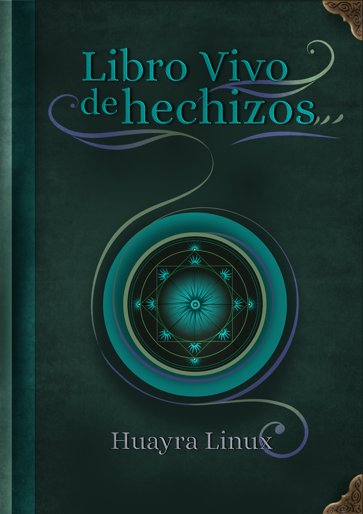

# libro-vivo-hechizos
Libro vivo de Hechizos de Huayra Linux

El libro vivo de hechizos de Huayra es un manual integral, que incluye desde fundamentos filosóficos y marcos políticos del proyecto hasta indicaciones técnicas de cómo instalar el sistema operativo, cómo agregar aplicaciones y cómo mantenerlo actualizado.
¿Por qué un libro de hechizos?  Porque no hay que dejar de jugar,  y si tenemos que lidiar con lo desconocido, ¡qué mejor que un poco de magia de nuestro lado!
	Parte de esa magia consta en que este manual se actualizará automáticamente cuando lo vea en el Escritorio de Huayra, ya que es un paquete más del sistema y cuando hagamos modificaciones, llegarán en forma de actualización junto con las demás mejoras de software.

